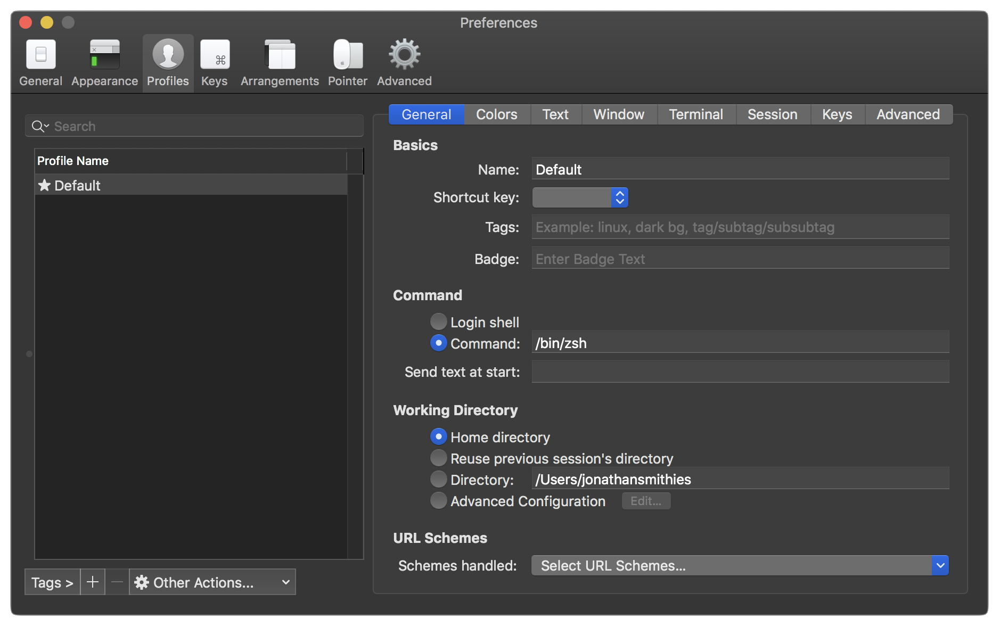
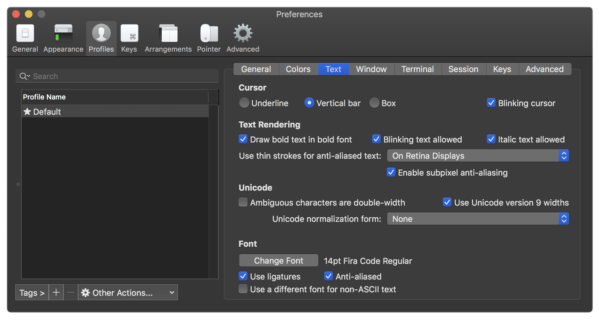
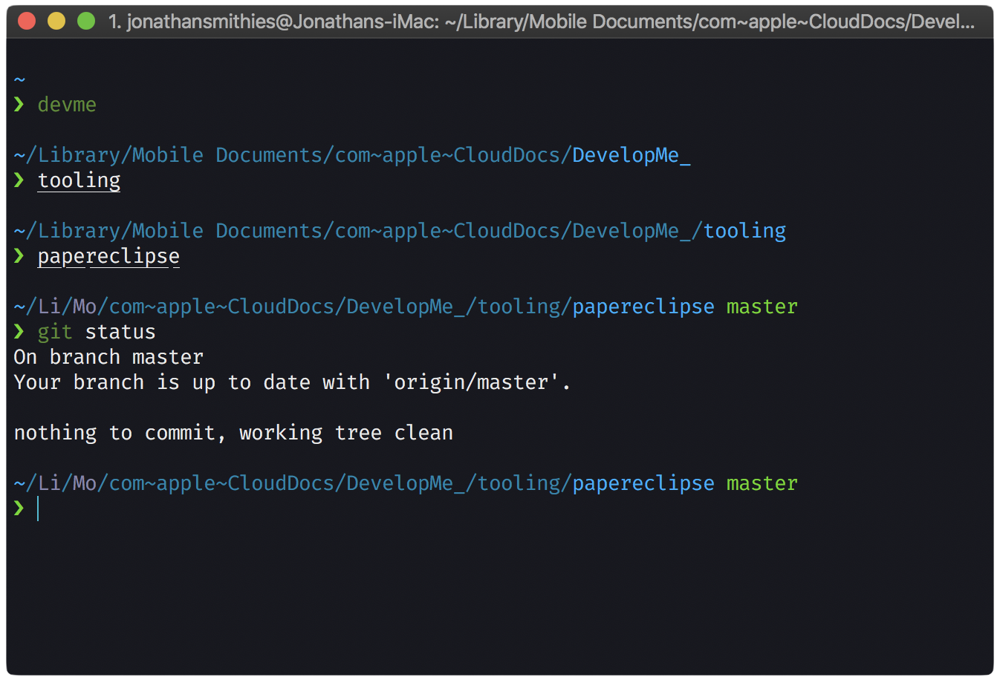

# Customise iTerm

### 1. Install iTerm2

For customising and installing themes we’ll require a better terminal than the default one on macOS.

If you haven't already, download and install iTerm2 from [here](https://www.iterm2.com/downloads.html).

### 2. Install ZSH

The Z shell (also known as zsh) is a Unix shell that is built on top of bash (the default shell for macOS) with additional features.

Copy and run the following code in iTerm:
```bash
brew install zsh
```

Quit and restart iTerm.

### 3. Install Oh My Zsh

Oh My Zsh is an open source, community driven framework for managing zsh configuration. It has a lot of features to customise the terminal and a lot of themes available.
Run this in your terminal:
```bash
sh -c "$(curl -fsSL https://raw.githubusercontent.com/robbyrussell/oh-my-zsh/master/tools/install.sh)"
```

Quit and restart iTerm.

### 4. Set zsh as the default terminal environment

- Go to iTerm2 preferences

- Head to Profiles -> General

- Paste `/bin/zsh` in the Command textbox and restart iTerm2



### 5. Install Fira Code font

Fira Code is a special monospace font that supports ligatures and special characters for web languages.

Unzip FiraCode.zip and install all font files inside the unzipped folder to your Mac.

 - Open iTerm2 preferences

 - Head to Profiles -> Text

 - Change font to Fira Code

 - Make sure 'Use ligatures' checkbox is selected

 

### 6. Install Powerlevel10k theme

Copy and execute the following code in iTerm:

```bash
git clone https://github.com/romkatv/powerlevel10k.git $ZSH_CUSTOM/themes/powerlevel10k
```

Run the following code in iTerm to open the ZSH config file in Atom.
```bash
open -a 'Atom' ~/.zshrc
```
In that file, make sure the ZSH_THEME is set to:
```bash
ZSH_THEME=powerlevel10k/powerlevel10k
```

Quit and restart iTerm.

### 7. Configure Powerlevel10k with lean prompt style

Once you've installed Powerlevel10k, run these commands to apply lean style.
```bash
curl -fsSL -o ~/p10k-lean.zsh https://raw.githubusercontent.com/romkatv/powerlevel10k/master/config/p10k-lean.zsh
echo 'source ~/p10k-lean.zsh' >>! ~/.zshrc
```

Quit and restart iTerm.

### 8. Et voila!

