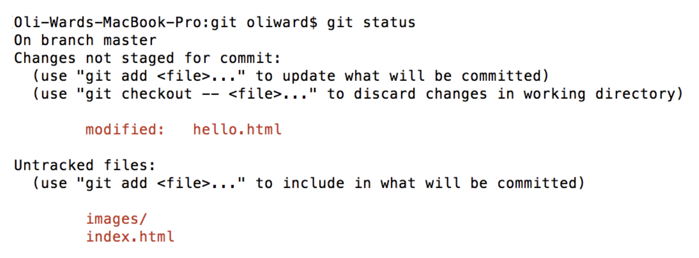
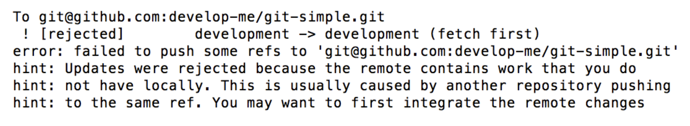
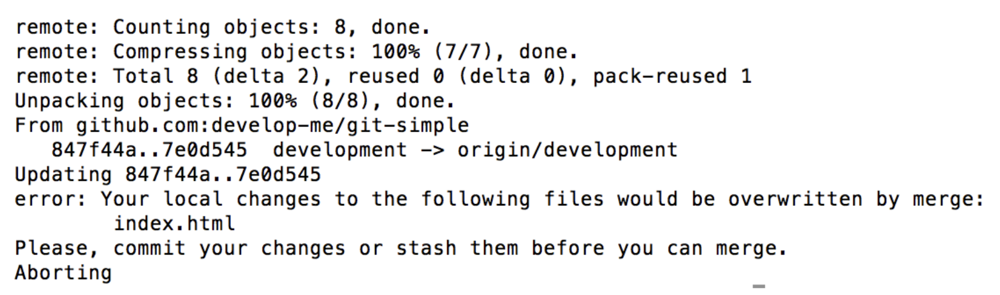
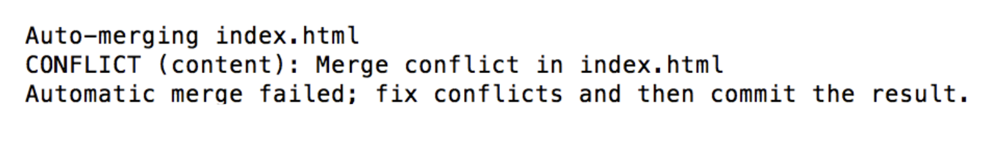

# Quiz

#### 1. Getting setup with Git

What does this command do?

```bash
$ git remote add origin git@github.com:develop-me/drupal1.git
```

This sets up a relationship between an (existing) local repository and the remote repository at the given origin URL.

#### 2. Committing files

How would I stage the images folder and index.html for a commit with message "Apple" and then commit hello.html with message "Banana"?



```bash
# add untracked file and folder
$ git add images/ index.html
# commit the currently staged items
$ git commit -m "Apple"

# commit the latest version hello.html
$ git commit -am "Banana"
```

#### 3. Oh noes no.1

What command have I just run and what has gone wrong? What should I do next?



You've just done a git push from a local branch, but the remote branch has work that your local branch is missing. You need to run a `git pull`. Then run the `git push` again.

#### 4. Oh noes no.2

What command have I just run and what has gone wrong? What should I do next?



You've tried to run a `git pull` without committing recent changes made on your local repo. Commit your changes, then run `git pull` again.

#### 5. Oh noes no.3

What command have I just run and what has gone wrong? What should I do next?



You've just run `git pull` but your changes conflict with the remote changes for the same lines of code, and Git doesn't know which changes to keep or discard. You need to resolve the conflict manually in your text editor. Then commit the resulting clean files.

#### 6. Burn it all!

How do you 'throw away' all work since last commit, and revert to how the files were at that moment?

```bash
$ git reset --hard HEAD
```

#### 7. (Sort of) Burn it all!

How do you 'throw away' the last commit (bbbbbb), going back to the commit before last (aaaaaa), but keep the files as they are (in commit bbbbbb), to not lose that work.

```javascript
$ git reset HEAD~
```

#### 8. Ignore it all!

Create a .gitignore file that will cause Git to only track hello.html in my folder:


Remove currently tracked files from tracking, if they have already been added

```bash
$ git rm --cached images/ .DS_Store index.html .Thumb_db super-secret-config.php
$ touch .gitignore
$ nano .gitignore
```

Either, add the files you don't want to track to the .gitignore.js file, or use a whitelist approach and tell the .gitignore file which files you **do** want to track.

```
*
!hello.html
```


#### 9. Describe the process

You're working in a team that uses Gitflow.
Document the steps, and git commands, from starting a new piece of work, to submitting it as a pull request.

```bash
# Clone remote repo into local folder
$ git clone {repository URL} {folder to create}
# Checkout the development branch
$ git checkout development
# Pull the development branch to your local repo
$ git pull
# Create a feature branch to work on
$ git branch my-feature-branch
# Checkout new feature branch
$ git checkout my-feature-branch
...
```

Do work / make changes

```bash
# Add any new files
$ git add {new file name}
# Commit your changes
$ git commit -am "commit message"
# Push your local branch to remote branch
$ git push origin my-feature-branch
...
```

Next, go to GitHub.

Find your branch in Code => Branches

Create pull request for your branch (make sure it's going into the development branch)

#### 10. npm & gulp

We're starting working on a new project and want to bring in some of our favourite workflow from a previous project.

What steps should we take and what commands will we need to run?

1.  Initalise npm and install npm packages for gulp

```bash
$ npm init
$ npm install {module name}
...
```

2.  Create gulpfile.js with gulp tasks

3.  Run tasks

Alternatively, you could bring `package.json` and `gulpfile.js` over from the previous project, then use `npm install`.

#### 11. Git, npm & gulp

Our fresh project needs a .gitignore file, what should its contents be?

The `node_modules` folder and `super-secret-config.php` file.

#### 12. Gulp and git

Our project uses gulp tasks to compile our source sass files into a styles.min.css file.
In merging another developer's work we end up with these files **having conflicts**, what should we do to resolve each?

-   `/scss/_headings.scss`

      Add `_headings.scss` to scss import file, then run gulp 'styles' tasks to merge and minify into `styles.min.css`

-   `/css/styles.min.css`

      Do nothing

-   `about.html`

      Fix the merge conflict
